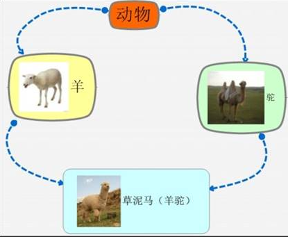

# 继承

**继承是面向对象三大特性之一**

类有父类（基类）和子类（派生类），子类继承父类的特性，并发展自己的特性

## 基本语法

**==class 子类 : 继承方式 父类==**

继承方式有：
* 公共（public）
* 保护（protected）
* 私有（private）

比如：
```C++
//公共页面
class BasePage {
public:
	void header()
	{
		cout << "首页、公开课、登录、注册...（公共头部）" << endl;
	}

	void footer()
	{
		cout << "帮助中心、交流合作、站内地图...(公共底部)" << endl;
	}
	void left()
	{
		cout << "Java,Python,C++...(公共分类列表)" << endl;
	}

};

//Java页面
class Java : public BasePage
{
public:
	void content()
	{
		cout << "JAVA学科视频" << endl;
	}
};

```

## 继承方式


public继承：
|父类                |子类      |
|--                  |--        |
|公共（public）      |public    |
|保护（protected）   |protected |
|私有（private）     |不可访问  |

protected继承：
|父类                |子类      |
|--                  |--        |
|公共（public）      |protected |
|保护（protected）   |protected |
|私有（private）     |不可访问  |

private继承：
|父类                |子类      |
|--                  |--        |
|公共（public）      |private   |
|保护（protected）   |private   |
|私有（private）     |不可访问  |

**父类的所有内容都会被子类所继承，这在内存上有体现，只是访问不到private的罢了。**

## 父类 / 子类的构造 / 析构顺序
现有的父亲后有的孩子，有点像栈？
**父类构造 -> 子类构造 -> 子类析构 -> 父类析构**

## 父类子类有同名成员时
子类访问子类同名变量/函数：直接访问
子类访问父类同名变量/函数：**加作用域**
**对静态变量/函数：** 处理方式一样，只不过有两种访问的方式（通过对象s.m_A 和 通过类名Son::Base::m_A）

**示例：**
```C++
class Base {
public:
	Base()
	{
		m_A = 100;
	}
	void func()
	{
		cout << "Base - func()调用" << endl;
	}
	void func(int a)
	{
		cout << "Base - func(int a)调用" << endl;
	}
public:
	int m_A;
};


class Son : public Base {
public:
	Son()
	{
		m_A = 200;
	}
	void func()
	{
		cout << "Son - func()调用" << endl;
	}
public:
	int m_A;
};

void test01()
{
	Son s;
	cout << "Son下的m_A = " << s.m_A << endl;
	// 加作用域访问父类的
	cout << "Base下的m_A = " << s.Base::m_A << endl;
	s.func();
	// 加作用域访问父类的
	s.Base::func();
	s.Base::func(10);

}
int main() {
	test01();
}
```

**静态示例：**

```C++
class Base {
public:
	static void func()
	{
		cout << "Base - static void func()" << endl;
	}
	static void func(int a)
	{
		cout << "Base - static void func(int a)" << endl;
	}

	static int m_A;
};

int Base::m_A = 100;

class Son : public Base {
public:
	static void func()
	{
		cout << "Son - static void func()" << endl;
	}
	static int m_A;
};

int Son::m_A = 200;

//同名成员属性
void test01()
{
	//通过对象访问
	cout << "通过对象访问： " << endl;
	Son s;
	cout << "Son  下 m_A = " << s.m_A << endl;
	cout << "Base 下 m_A = " << s.Base::m_A << endl;

	//通过类名访问
	cout << "通过类名访问： " << endl;
	cout << "Son  下 m_A = " << Son::m_A << endl;
	cout << "Base 下 m_A = " << Son::Base::m_A << endl;
}

//同名成员函数
void test02()
{
	//通过对象访问
	cout << "通过对象访问： " << endl;
	Son s;
	s.func();
	s.Base::func();

	cout << "通过类名访问： " << endl;
	Son::func();
	Son::Base::func();
	//出现同名，子类会隐藏掉父类中所有同名成员函数，需要加作作用域访问
	Son::Base::func(100);
}
int main() {

	//test01();
	test02();

	system("pause");

	return 0;
}
```


## 多继承 —— 一个类继承多个类（不建议使用）

**`class 子类 ：继承方式 父类1 ， 继承方式 父类2...`**

**问题：**（二义性）多个父类中有同名成员出现，需要加作用域区分

**示例：**

```C++
class Base1 {
public:
	Base1()
	{
		m_A = 100;
	}
public:
	int m_A;
};

class Base2 {
public:
	Base2()
	{
		m_A = 200;  //开始是m_B 不会出问题，但是改为mA就会出现不明确
	}
public:
	int m_A;
};


class Son : public Base2, public Base1 
{
public:
	Son()
	{
		m_C = 300;
		m_D = 400;
	}
public:
	int m_C;
	int m_D;
};

void test01()
{
	Son s;
	cout << "sizeof Son = " << sizeof(s) << endl;
	cout << s.Base1::m_A << endl;
	cout << s.Base2::m_A << endl;
}

int main() {
	test01();
	return 0;
}
```


## 菱形继承
**如图：**


**问题：**
1. 多继承产生的二义性。（**加作用域来区分**）
2. 最下层子类继承自最上层父类了两次，实际上只需要一份，资源浪费。（**解决方式：继承前加virtual关键字变为虚继承**）


**示例：**
```C++
class Animal
{
public:
	int m_Age;
};

//此时公共的父类Animal称为虚基类
class Sheep : virtual public Animal {};
class Tuo   : virtual public Animal {};
class SheepTuo : public Sheep, public Tuo {};

void test01()
{
	SheepTuo st;
	st.Sheep::m_Age = 100;
	st.Tuo::m_Age = 200;

	cout << "st.Sheep::m_Age = " << st.Sheep::m_Age << endl;
	cout << "st.Tuo::m_Age = " <<  st.Tuo::m_Age << endl;
	cout << "st.m_Age = " << st.m_Age << endl;
}


int main() {
	test01();
	return 0;
}
```

