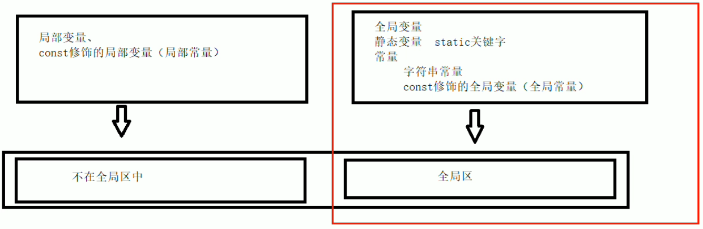

在 C++ 中，程序运行时内存分为 **四个核心区域**，各自承担不同的职责。
# 1. 代码区（Code Area / Text Segment）
**作用：** 存储编译后的 二进制机器指令（即程序的执行代码）。
这一区域在程序没有执行时就存在了
**特点：**
1. 只读，防止程序意外修改指令。
2. 共享：多个相同程序实例可共享同一份代码（如多开同一个可执行文件）。
3. 大小固定：在程序加载时确定。

# 2. 全局区（Global Area / Static Storage）
**作用：** 存储 全局变量（非函数内，包括main） 、 静态变量（static） 和 常量（字符串常量 + const修饰的全局变量）。

**特点：**
1. 在程序启动时分配，结束时由操作系统释放。


# 3. 栈区
**作用：** 由**编译器**管理、开辟、释放。存储 **局部变量、形参** 和 函数调用信息（如返回地址）。
**注意：** 不要返回局部变量的地址。

**特点：**
1. 自动管理：由编译器分配和释放（函数结束时自动清理）。
2. 速度快：内存分配/释放仅需移动栈指针。
3. 大小有限（通常几 MB），溢出会导致栈崩溃（如递归过深）。

```c++
int * func()
{
	int a = 10;
	return &a;
}
int main() {
	int *p = func();
	cout << *p << endl; // 这里解引用会出问题，因为p指向的内容被回收了
	cout << *p << endl;
	return 0;
}
```

# 4. 堆区
**作用：** 存储 动态分配的内存（需手动管理）。

**特点：**
1. 手动控制：通过 new/malloc 分配，delete/free 释放。但如果程序结束也没手动释放，操作系统会自动回收。
2. 空间大：受系统可用内存限制。
3. 速度较慢：分配需查找可用内存块。
4. 内存泄漏风险：忘记释放会导致内存泄漏。

```c++
int* func()
{
	int* a = new int(10); // 用new开辟堆区
	return a;
}
int main() {
	int *p = func();
	cout << *p << endl; // 由于没有回收堆，p指向的内容不变，还是10
	cout << *p << endl;
	return 0;
}
```

**new操作：**


**示例1： 基本语法**

```c++
int* func()
{
	int* a = new int(10);
	return a;
}

int main() {

	int *p = func();

	cout << *p << endl;
	cout << *p << endl;

	//利用delete释放堆区数据
	delete p;

	//cout << *p << endl; //报错，释放的空间不可访问

	system("pause");

	return 0;
}
```


**示例2：开辟数组**

```c++
//堆区开辟数组
int main() {

	int* arr = new int[10];

	for (int i = 0; i < 10; i++)
	{
		arr[i] = i + 100;
	}

	for (int i = 0; i < 10; i++)
	{
		cout << arr[i] << endl;
	}
	//释放数组 delete 后加 []
	delete[] arr;

	system("pause");

	return 0;
}

```

