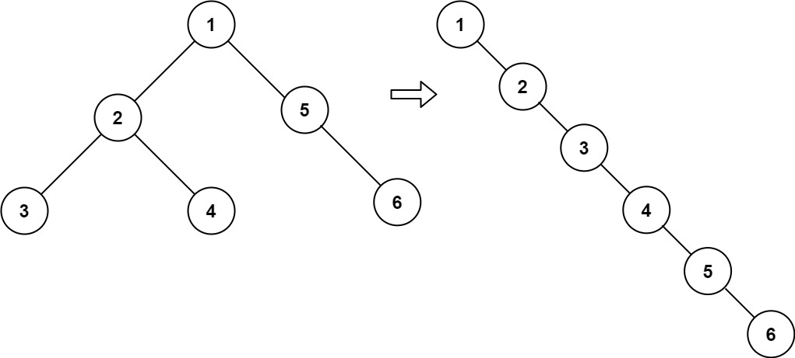

# 题目
给二叉树根结点 root ，展开为单链表，链接顺序是前序（中左右）：


# 思路
如果要变成中左右，逻辑就是`root->right`挂到`root->left`的最右边, 再用`root->left`覆盖`root->right`，最后设置`root->left = nullptr`。
终止条件：root为空
递归顺序：左 右 中 --- 只能最后处理中间节点
假如先处理 中，左孩子都被覆盖成空了，后面没法调了。

```c++
class Solution {
public:
    void flatten(TreeNode* root) {
        if (!root) return;
        flatten(root->left);
        flatten(root->right);

        if (root->left) {
            TreeNode* p = root->left;
            while (p->right) {
                p = p->right;
            }
            p->right = root->right;
            root->right = root->left;
            root->left = nullptr;
        }
    }
};
```