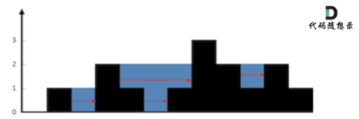

# 问题
给定 n 个非负整数表示每个宽度为 1 的柱子的高度图，计算按此排列的柱子，下雨之后能接多少雨水。

示例 1：
输入：height = [0,1,0,2,1,0,1,3,2,1,2,1]
输出：6
解释：上面是由数组 [0,1,0,2,1,0,1,3,2,1,2,1] 表示的高度图，在这种情况下，可以接 6 个单位的雨水（蓝色部分表示雨水）。

示例 2：
输入：height = [4,2,0,3,2,5]
输出：9

# 题解
用单调栈来求解是横向计算面积，如图

1. 找右侧第一个比自己大的元素H1（当前遍历元素i）
2. 由于是单调栈，栈内第二个元素H2是左边第一个比自己大的元素，取min(H1,H2)，减去当前高度H0（栈顶），作为雨水高度H
3. 雨水宽度W = 右边第一个高的i - 左边第一个高的H2 - 1
4. 处理等于情况时，也直接压入，后面计算H的时候，对右面的相等元素，H = 0（左面-自己）

```c++
class Solution {
public:
    int trap(vector<int>& height) {
        stack<int> st;
        st.push(0);
        int sum = 0;
        for (int i = 0; i<height.size() ; i++) {
            if (height[i] <= height[st.top()]) {
                st.push(i);
            } else {
                while (!st.empty() && height[i] > height[st.top()]) {
                    int H0 = st.top();
                    st.pop();
                    if (!st.empty()) {
                        int H2 = st.top();
                        int H = min(height[i], height[H2]) - height[H0];
                        int W = i - H2 - 1;
                        sum += H*W;
                    }
                }
                st.push(i); 
                // 这里不push可能导致空栈但下一轮仍然 在if里st.top()，报错里会显示"reference binding to misaligned address"访问非法内存
            }
        }
        return sum;
    }
};
```