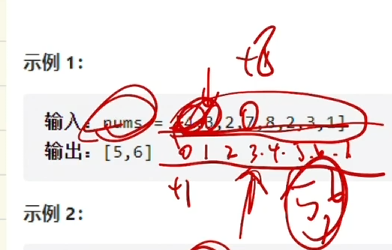

# 题目 
一个含 n 个整数的数组 nums，
nums[i] 在区间 [1, n] 内，
找出所有在 [1, n] 范围内但没有出现在 nums 中的数字，
以数组的形式返回结果。

示例 1：
输入：nums = [4,3,2,7,8,2,3,1]
输出：[5,6]

示例 2：
输入：nums = [1,1]
输出：[2]

# 思路

建立1到n的哈希表，遍历nums，记录出现次数，返回次数为0的数。

## 进阶：空间复杂度O(1)
https://www.bilibili.com/video/BV1414y1Y7eZ/?spm_id_from=333.337.search-card.all.click&vd_source=09284dd3830471cccd8fc68336e3a1b2


由于数组内所有值小于n，因此可以把数组内的数值再减一作为下标。
比如第一个位置，4，计算下标=3，对应到了nums[3] == 7，再把7+n，如此遍历一遍，到最后**没被加过数的下标再+1所对应的数**就是没出现过的。

```c++
class Solution {
public:
    vector<int> findDisappearedNumbers(vector<int>& nums) {

        int n = nums.size();
        for (auto& num : nums) {
            int x = (num - 1) % n; // 怕出现多次
            if (nums[x] <= n) {
                nums[x] += n;
            }
        }
        vector<int> ret;
        for (int i = 0; i < n; i++) {
            if (nums[i] <= n) { // 找没被加过的数，按来的时候的计算方法往回倒
                ret.push_back(i + 1);
            }
        }
        return ret;
    }
};
```