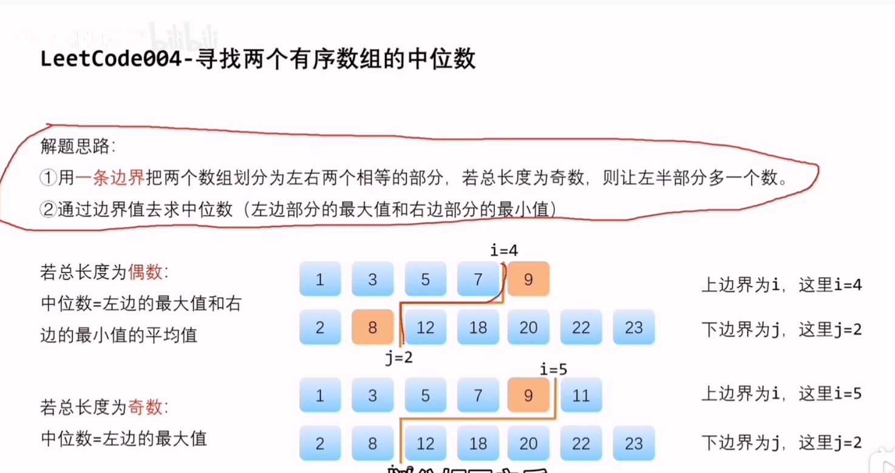
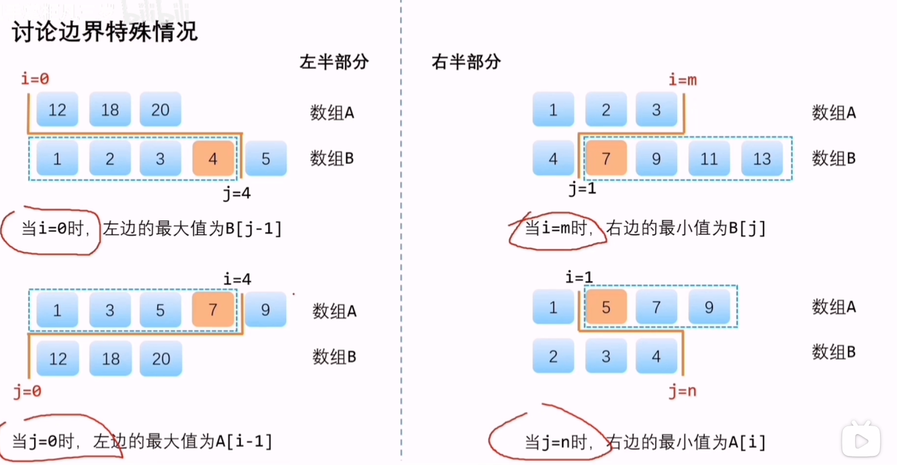
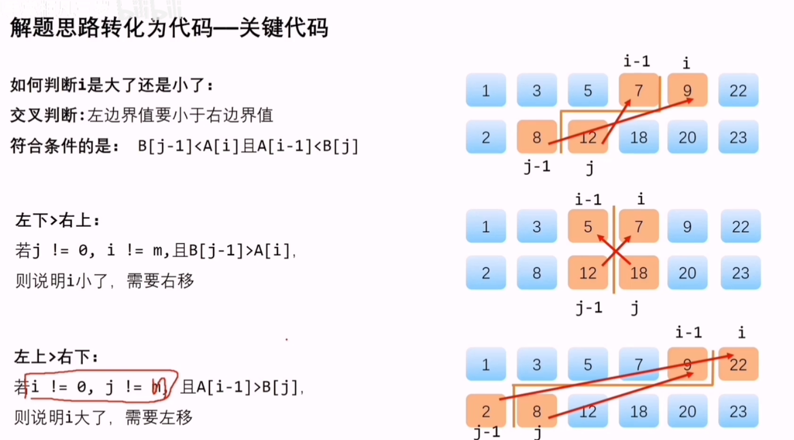

# 题目
给定两个大小分别为 m 和 n 的正序（从小到大）数组 nums1 和 nums2。请你找出并返回这两个正序数组的 中位数。  
算法的时间复杂度应该为 O(log (m+n)) 。

示例 1：  
输入：nums1 = [1,3], nums2 = [2]  
输出：2.00000  
解释：合并数组 = [1,2,3] ，中位数 2  

示例 2：  
输入：nums1 = [1,2], nums2 = [3,4]  
输出：2.50000  
解释：合并数组 = [1,2,3,4] ，中位数 (2 + 3) / 2 = 2.5  

# 思路
https://www.bilibili.com/video/BV1H5411c7oC/?spm_id_from=333.337.search-card.all.click&vd_source=09284dd3830471cccd8fc68336e3a1b2


用一条线把这俩数组分两半，记上边分割点为i，下边分割点为j  
如果长度和是奇数，那左侧个数应多一位，中位数 = 左侧最大值。  
如果长度和为偶数，那左右个数一样，中位数 = 左侧最大值 + 右侧最小值。

特殊情况：  

只划分到了左上（i=0），左侧最大值=B[j-1]  
只划分到了左下（j=0），左侧最大值=A[i-1]  
只划分到了右上（j=n），右侧最小值=A[i]  
只划分到了右下（i=m），右侧最小值=B[j]  

A长度为m, B长度为n。由于i+j=(m+n+1)/2，i定了j也就定了。  
问题变为了如何取i --- 二分查找。left=0;right=m;  
判断i的大小：B[j-1] < A[i] && A[i-1] < B[j]

如果i大了，把二分查找的区间向右移动(left=i+1)，反之向左(right=i-1)。


```c++

class Solution {
public:
    double findMedianSortedArrays(vector<int>& A, vector<int>& B) {
        int m = A.size(); int n = B.size();
        // 始终让A保持短的 假如A=[12345] B=[10 11 12]，那区间全在A上了 j就是负数了，后面报错了
        if (m > n) {
            return findMedianSortedArrays(B, A);
        }
        
        if (m == 0) {
            if (n % 2 == 1) return B[n / 2];
            else return (B[n / 2 - 1] + B[n / 2]) / 2.0;
        }

        int left = 0; int right = m;
        int i = 0; int j = 0;

        while(left <= right) { // 其实 < 也性，但是这个题写<=简单一些
            i = (left + right) / 2;
            j = (m + n + 1) / 2 - i;
            
            if (j!=0 && i!=m && B[j-1] > A[i]) left = i+1; // 防止越界，最后符合条件的时候有可能是i==1m, j==0的
            else if (i!=0 && j!=n && A[i-1] > B[j]) right = i-1; // 防止越界
            else break; //符合条件
        }

        double left_max = 0; double right_min = 0;
        if (i==0) left_max = B[j-1];
        else if (j==0) left_max = A[i-1];
        else {left_max = max(A[i-1], B[j-1]);}

        if (i==m) right_min = B[j];
        else if (j==n) right_min = A[i];
        else {right_min = min(A[i], B[j]);}

        
        if ((m+n)%2==1) return left_max;
        else return (left_max + right_min) / 2;

    }
};


```
