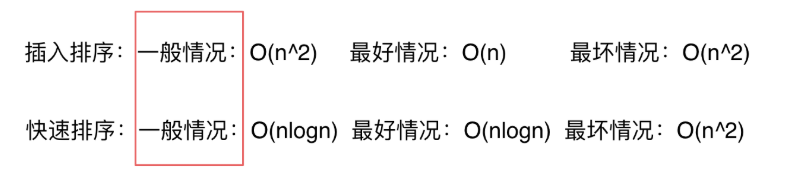
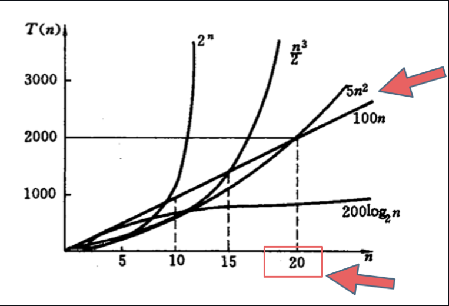

# 时间复杂度

## 1. 定义

描述算法运行的时间。  

假设算法的问题规模为n，那么操作单元数量便用函数f(n)来表示，随着n的增大，算法执行时间的增长率和f(n)的增长率相同，这称作为算法的渐近时间复杂度，简称时间复杂度，记为 O(f(n))。  

如果数据用例影响了时间复杂度，取一般情况。比如：


## 2. 不同规模的影响


* 如果数据规模小，不是时间复杂度越小越好
* 默认情况大O的数据量级非常大，常数项系数已经不起决定性作用，因此**忽略常数项**，除非常数项巨大(e.g. $10^7$)
* 大规模数据时时间复杂度排序：  
$O(1) < O(logn) < O(n) < O(nlogn) < O(n^2) < O(n^3) < O(2^n)$

## 3. 化简

1. 消除常数项
2. 去掉系数
3. 只保留高阶项  
e.g. $O(2n^2 + 10n + 1000) → O(n^2)$  

## 4. 测试leetcode服务器运行速度

|     复杂度      |测试用例数 |
|        -        |     -   |
| $O(n)$          | < $10^8$|
| $O(n^2)$        | < $10^4$|
| $O(n\log n)$    | < $10^7$|

## 5. 递归的时间复杂度

**递归算法的时间复杂度 = 递归次数 * 每次递归中的操作数**
案例：求$x^n$

```C++
// O(n)
int function3(int x, int n) {
    if (n == 0) return 1;
    if (n == 1) return x;

    if (n % 2 == 1) {
        return function3(x, n / 2) * function3(x, n / 2)*x;
    }
    return function3(x, n / 2) * function3(x, n / 2); 
    // 每次递归都调用了两次 function3, 每次递归种的操作数指数增长
}
```

```
         f(n)
       /     \
    f(n/2)   f(n/2)
    /   \     /   \
f(n/4)...  f(n/4)...

* 这棵树的高度是 log n，但每一层的节点数是指数增长的。
* 总节点数是 O(n)。
```

```C++
// O(logn)
int function4(int x, int n) {
    if (n == 0) return 1;
    if (n == 1) return x;
    int t = function4(x, n / 2);// 每次递归都只调用一次 function4
    if (n % 2 == 1) {
        return t * t * x;
    }
    return t * t;
}
```